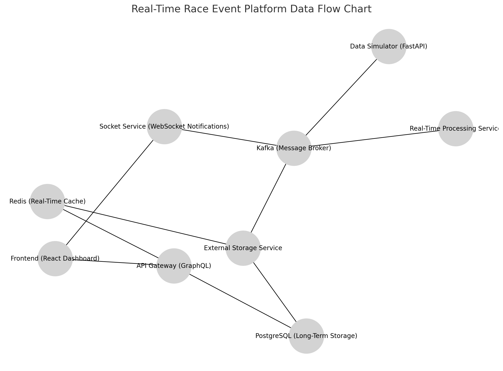

# Data Flow Chart Documentation

## **Overview**
This document outlines the data flow architecture for the Real-Time Race Event Platform. The platform uses Apache Kafka as the central hub for event-driven communication between services. It includes multiple producers and consumers, supporting real-time processing, storage, and frontend updates.

---

## **Data Flow Chart**

- **Data Simulator (FastAPI)** publishes raw telemetry data to **Kafka**.
- **Real-Time Processing Service** reads raw data from **Kafka**, processes it, and publishes calculated results back to **Kafka**.
- **Kafka** distributes data to:
  - **External Storage Service**, which saves data to **Redis** and **PostgreSQL**.
  - **Socket Service**, which sends real-time updates via WebSocket.
- **Redis** and **PostgreSQL** serve data to the **API Gateway**.
- The **API Gateway** provides combined results to the **Frontend (React Dashboard)**.

## **Data Flow Explanation**

### **Producers**:
1. **Data Simulator (FastAPI)**:
   - Publishes raw telemetry data to Kafka (`telemetry_raw` topic).

2. **Real-Time Processing Service**:
   - Publishes processed race data (e.g., leaderboards, pit stop strategies) to Kafka (`telemetry_processed` topic).

---

### **Kafka Consumers**:
1. **External Storage Service**:
   - Subscribes to both `telemetry_raw` and `telemetry_processed` topics.
   - Writes raw and processed data to:
     - **Redis**: For fast, real-time access by the API Gateway and Socket Service.
     - **PostgreSQL**: For long-term storage and analytics.

2. **Socket Service**:
   - Subscribes to `telemetry_processed` for sending instant updates to clients via WebSocket.

---

### **Storage**:
1. **Redis (Real-Time Cache)**:
   - Stores ephemeral, high-priority race data (e.g., current leaderboard, latest telemetry).
   - Data is used by the Socket Service to push live updates and by the API Gateway to serve real-time queries.

2. **PostgreSQL (Long-Term Storage)**:
   - Stores all historical telemetry and processed data for analytics and reporting.
   - Data is accessed by the API Gateway for historical data queries.

---

### **API Gateway (GraphQL)**:
- Queries:
  - **Redis** for low-latency, real-time data.
  - **PostgreSQL** for historical data.
- Combines results and serves them to the **Frontend (React Dashboard)**.

---

### **Frontend (React Dashboard)**:
- Receives:
  - Real-time updates via WebSocket from the **Socket Service**.
  - Query results (real-time and historical) via the **API Gateway**.

---

## **Key Improvements**
1. Corrected connection between **Frontend** and **Redis**.
2. Added directional arrows to clarify data flow.
3. Adjusted node layout to improve readability and visual structure.
4. Detailed roles for each service.